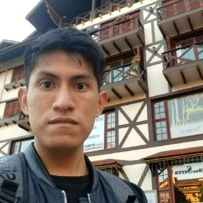
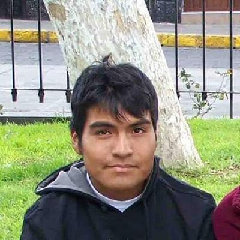
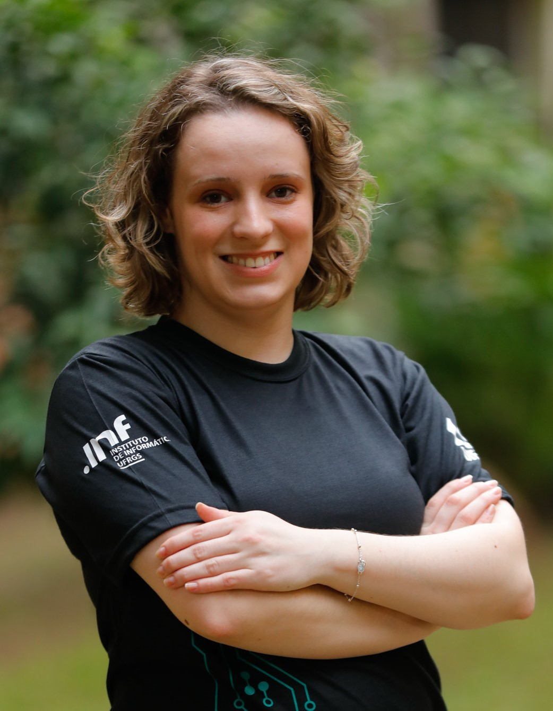

# WHC2021SIC Project Template

<!-- Replace Project Template by your team name in title and description -->

Project Template for the IEEE World Haptics Conference 2021 Student Innovation Challenge

https://2021.worldhaptics.org/sic/

## Authors

### Team

#### Franklin Bastidas

Franklin Bastidas is currently a MSc. student in Computer Science at the Federal University of Rio Grande do Sul, his recent research areas are focused on the simulation of physical movements, human-computer interaction and control of haptic devices. He received his bachelor's degree in Mechatronics Engineering at the Instituto Tecnológico Metropolitano, Medellín in 2019, where he was associated with two research projects focused on meteorological data and swarm robotics design and control.

#### Renan Guarese

Renan Guarese is an HCI researcher and PhD student in Computer Science at RMIT - Australia. He obtained his MSc. degree in Computer Science at UFRGS, studying Human-Computer interaction. Worked with Data Visualization in Augmented Reality, including a Situated Visualization of Electromagnetic Compatibility project at Halmstad University, in Sweden. Mainly uses Unity, Android and the HoloLens for his applications. Also holds a BSc. in Computer Science from UFRGS, having spent one year at Radford University, in the USA.

Find more information on his <!-- update pronouns--> [page](https://www.researchgate.net/profile/Renan-Guarese).

### Yhonatan Iquiapaza

Yhonatan Iquiapaza is currently MSc. student in Computer Science at Federal University of Rio Grande do Sul, his research focus on Data Visualization, Human-Computer Interaction, Immersive Analytics, Physicalization and Virtual/Augmented Reality. He finished his studies as a bachelor in System Engineering at Universidad Nacional de San Agustin, in Arequipa-Peru. He usually uses Unity, Javascript and Hololens.

Find more information on his [page](https://www.researchgate.net/profile/Yhonatan-Iquiapaza).

### Carlos Johansson

Carlos Johansson is currently MSc. student in Computer Science at Federal University of Rio Grande do Sul, his research focus on Human-Computer Interaction, Physicalization and Virtual/Augmented Reality. He received a bachelor's degree in biomedical informatics from the Federal University of Health Sciences of Porto Alegre.

### Mariane Giambastiani

Mariane Giambastiani is currently MSc. student in Computer Science at Federal University of Rio Grande do Sul, his research focuses on Data Visualization, Human-Computer Interaction, Immersive Analytics, Physicalization and Augmented Reality. She obtained her BSc. in Computer Engineering from Federal University of Rio Grande do Sul.

<!-- ### Advisor -->

<!-- Uncomment this section title and add a #### Name subsection if your team appointed an advisor. -->

### Chairs

#### Christian Frisson

Christian Frisson is an associate researcher at the Input Devices and Music Interaction Laboratory (IDMIL) (2021), previously postdoctoral researcher at McGill University with the IDMIL (2019-2020), at the University of Calgary with the Interactions Lab (2017-2018) and at Inria in France with the Mjolnir team (2016-2017). He obtained his PhD at the University of Mons, numediart Institute, in Belgium (2015); his MSc in “Art, Science, Technology” from Institut National Polytechnique de Grenoble with the Association for the Creation and Research on Expression Tools (ACROE), in France (2006); his Masters in Electrical (Metrology) and Mechanical (Acoustics) Engineering from ENSIM in Le Mans, France (2005).
Christian Frisson is a researcher in Human-Computer Interaction, with expertise in Information Visualization, Multimedia Information Retrieval, and Tangible/Haptic Interaction. Christian creates and evaluates user interfaces for manipulating multimedia data. Christian favors obtaining replicable, reusable and sustainable results through open-source software, open hardware and open datasets.
With his co-authors, Christian obtained the IEEE VIS 2019 Infovis Best Paper award and was selected among 4 finalists for IEEE Haptics Symposium 2020 Most Promising WIP.

Find more information on his [website](https://frisson.re).

#### Jun Nishida

Jun Nishida is **Currently** Postdoctoral Fellow at University of Chicago & Research Fellow at Japan Society for the Promotion of Science (JSPS PDRA) / **Previously** JSPS Research Fellow (DC1), Project Researcher at Japanese Ministry of Internal Affairs and Communications, SCOPE Innovation Program & PhD Fellow at Microsoft Research Asia / Graduated from Empowerment Informatics Program, University of Tsukuba, Japan.

I’m a postdoctoral fellow at University of Chicago. I have received my PhD in Human Informatics at University of Tsukuba, Japan in 2019. I am interested in designing experiences in which all people can maximize and share their physical and cognitive capabilities to support each other. I explore the possibility of this interaction in the field of rehabilitation, education, and design. To this end, I design wearable cybernic interfaces which share one’s embodied and social perspectives among people by means of electrical muscle stimulation, exoskeletons, virtual/augmented reality systems. Received more than 40 awards including Microsoft Research Asia Fellowship Award, national grants, and three University Presidential Awards. Review service at ACM SIGCHI, SIGGRAPH, UIST, TEI, IEEE VR, HRI.

Find more information on their [website](https://junis.sakura.ne.jp/wp).

#### Heather Culbertson

Heather Culbertson is a Gabilan Assistant Professor of Computer Science at the University of Southern California. Her research focuses on the design and control of haptic devices and rendering systems, human-robot interaction, and virtual reality. Particularly she is interested in creating haptic interactions that are natural and realistically mimic the touch sensations experienced during interactions with the physical world. Previously, she was a research scientist in the Department of Mechanical Engineering at Stanford University where she worked in the Collaborative Haptics and Robotics in Medicine (CHARM) Lab. She received her PhD in the Department of Mechanical Engineering and Applied Mechanics (MEAM) at the University of Pennsylvania in 2015 working in the Haptics Group, part of the General Robotics, Automation, Sensing and Perception (GRASP) Laboratory. She completed a Masters in MEAM at the University of Pennsylvania in 2013, and earned a BS degree in mechanical engineering at the University of Nevada, Reno in 2010. She is currently serving as the Vice-Chair for Information Dissemination for the IEEE Technical Committee on Haptics. Her awards include a citation for meritorious service as a reviewer for the IEEE Transactions on Haptics, Best Paper at UIST 2017, and the Best Hands-On Demonstration Award at IEEE World Haptics 2013.

Find more information on her [website](https://sites.usc.edu/culbertson/).

# Contents

Generated with `npm run toc`, see [INSTALL.md](INSTALL.md).

Once this documentation becomes very comprehensive, the main file can be split in multiple files and reference these files.

<!-- Table of contents generated by running from repository root: npm run toc -->

<!-- toc -->

- [Abstract](#abstract)
- [Introduction](#introduction)
- [Documentation](#documentation)
  - [Hardware](#hardware)
    - [Sensors wiring](#sensors-wiring)
  - [Software](#software)
- [Acknowledgements](#acknowledgements)
- [License](#license)

<!-- tocstop -->

# Abstract

<!-- Summarize your project: for now copy the short pitch from your proposal -->
Physicalization has been studied by the data visualization research community as a good way to help
people to understand and communicate data through physical representation. This type of data representation is widely used in museums as tangible surfaces and mockups, furthermore it is used
in the medical field as 3D prints for the study of human organs. However, building physical artifacts
to represent data can be expensive and very time-consuming. Another way to build this kind of data
visualization is using Augmented or Virtual Reality associated with tangible surfaces or haptic
stimulation. In this work, we explore the use of vibrotactile actuators to physically convey additional information to the visual data representation. Likewise, In the context of helping people understand data visualization with limited graphic resources, we propose an adaptive data physicalization surface.

# Introduction

<!-- Explain your project: for now copy the 300-word description from your proposal -->
We present a visuo-haptic approach and system that augments the visual experience of graphic data visualization with meaningful vibrotactile information. The user of our system explores charts and graphs either on a video monitor or on printed paper. When touching the data visualization, they feel vibrotactile patterns on the back of their hands that communicate other dimensions of the data at the point of contact that are not printed but help understand the data. The system recognizes the interaction location on the chart by means of a set of force sensors placed at the corners of the supporting surface (either a plastic clipboard or a video monitor). An array of vibrotactile actuators placed at the joints on the back of the user's hand modulate frequency and amplitude to build signals that convey the appropriate stimuli, in a process of dynamic physicalization.

# Documentation

## Hardware

### 1. Components:

* 1 [Raspberry Pi 4 Microcontroller](https://www.raspberrypi.org/products/raspberry-pi-4-model-b/) - **$35.00**
* 1 [Syntacts 8-Channel Amplifier Board](https://www.syntacts.org/hardware/)
* 1 [Audio Injector Octo 8-Channel Sound Card](http://www.audioinjector.net/rpi-octo-hat) - **$58.00**
* 1 [SparkFun Qwiic Hat for Raspberry Pi](https://www.sparkfun.com/products/14459) - **$6.50**
* 1 [SparkFun Qwiic 12-Bit 4-Channel ADC](https://www.sparkfun.com/products/15334) - **$21.00**
* 4 [Force Sensitive Resistors 0.5"](https://www.sparkfun.com/products/9375) - **$27.80**
* 8 [Linear Resonant Actuator](https://www.vibration-motor.com/coin-vibration-motors/coin-linear-resonant-actuators-lra/g1040003d)

* 1 [Qwiic Cable](https://www.sparkfun.com/products/14427) - **$1.50**
* 4 [RCA to 3.5mm](https://www.amazon.com/-/pt/dp/B071R4R5B8/ref=sr_1_3?__mk_pt_BR=%C3%85M%C3%85%C5%BD%C3%95%C3%91&dchild=1&keywords=3.5+mm+to+rca+cable&qid=1625242939&sr=8-3) - **$23.92**

* 1 [Ribbon Cable](https://www.sparkfun.com/products/10647) - **$4.95**

* 1 [Micro SD 16GB](https://www.amazon.com/-/pt/dp/B073K14CVB/ref=sr_1_4?__mk_pt_BR=%C3%85M%C3%85%C5%BD%C3%95%C3%91&crid=3GNPDDGQS061C&dchild=1&keywords=micro+sd+16gb+class+10&qid=1625244091&sprefix=microSD+16GB+class%2Caps%2C291&sr=8-4) - **$6.80**
* 4 [1k Resistor](https://www.sparkfun.com/products/10647) - **$3.80**

* 1 [Clipboard](https://www.amazon.com/Officemate-Recycled-Clipboard-Profile-83219/dp/B00181D6RO/ref=sr_1_15?dchild=1&keywords=clipboard&qid=1625246253&sr=8-15)/[Photo picture frame](https://www.amazon.com/AmazonBasics-Photo-Frame-Black-2-Pack/dp/B079LMX8SR/ref=sr_1_1_sspa?c=ts&dchild=1&keywords=Picture+Frames&qid=1625246205&refinements=p_n_material_browse%3A335846011&s=furniture&sr=1-1-spons&ts_id=1063286&psc=1&spLa=ZW5jcnlwdGVkUXVhbGlmaWVyPUEzNzNGTkgxOEk0TUxLJmVuY3J5cHRlZElkPUEwOTAxODYxM0ExR0RBVjFMWktBTSZlbmNyeXB0ZWRBZElkPUEwNTY0MDI1RzE4V0FJVExGTkpSJndpZGdldE5hbWU9c3BfYXRmJmFjdGlvbj1jbGlja1JlZGlyZWN0JmRvTm90TG9nQ2xpY2s9dHJ1ZQ==)/[Square Glass](https://www.amazon.com/CleverDelights-Inch-Square-Glass-Tile/dp/B08BWCB5XH/ref=sr_1_2?dchild=1&keywords=glass+tile+square&qid=1625246842&sr=8-2) - **$5.09/17.95/10.99**

* 1 [Micro-HDMI to HDMI](https://www.canakit.com/official-micro-hdmi-to-hdmi-cable.html?defpid=4651) - **$4.95**

* 1 [Double Sided Tape](https://www.amazon.com/QIXIAN-Double-Sided-Tape-Multipurpose/dp/B09379TJRP/ref=sr_1_2_sspa?crid=20OP47QBY60AT&dchild=1&keywords=tape+double+sided&qid=1625246588&sprefix=tape+doubl%2Caps%2C281&sr=8-2-spons&psc=1&spLa=ZW5jcnlwdGVkUXVhbGlmaWVyPUEyRVkwU1E0RE9SVUs2JmVuY3J5cHRlZElkPUFUUTVHQ0QzT0NYVUsmZW5jcnlwdGVkQWRJZD1BMDMxOTY5MUpXM0lOSTNQVUNFWCZ3aWRnZXROYW1lPXNwX2F0ZiZhY3Rpb249Y2xpY2tSZWRpcmVjdCZkb05vdExvZ0NsaWNrPXRydWU=) - **$8.99**

* 1 [Masking Tape](https://www.amazon.com/AmazonBasics-Masking-Tape-Inch-Rolls/dp/B07QHSKGMH/ref=sr_1_6?dchild=1&keywords=masked+tape&qid=1625247037&sr=8-6) - **$5.91**

### 2. Initial settings:

* **Actuators - cable - jumper male**: Each motor is connected and soldered to two of the ribbon cables, with the motors at one end and male jumpers at the other end.

* **Force sensors**: As with the previous item, each sensor is connected to two of the ribbon cables, having the sensors at one end and male jumpers at the other end.

* **Change I2C ADC address**: The I2c address 0x48 (default) is changed to address 0x49 because the Octo sound card is using this address as audio input, causing a conflict. For this you can continue with the [link](https://learn.sparkfun.com/tutorials/qwiic-12-bit-adc-hookup-guide/hardware-overview) steps. That is, cut the jumper connecting the center pin to 0x48 and then make a new connection to pin 0x49.

* **Disconnect potentiometer A3 from ADC**: The ADC have potentiometer connected to AN3 by default, to avoid possible unwanted results it's necessary that the range of values and sensitivity of the sensors have a similar behavior, for this the potentiometer is disconnected. To do this, just cut the jumper that connects the two TRIM A3 pins, as shown in this [link](https://learn.sparkfun.com/tutorials/qwiic-12-bit-adc-hookup-guide/hardware-overview) or following image:

### 3. Assemble hardware

**A. Raspberry Pi - Octo sound card - Sparkfun hat**

**B. Glove and Actuators**

**Octo sound card - RCA to 3.5mm**

**RCA to 3.5mm - Amplifier - Jumpers male**

**Jumpers male - Actuators - Glove**

Note that each motor will need to be gloved based on the pin number connected to the amplifier for proper representation of vibration. That is, each number represents the pin connected to the amplifier, following the image:

**C. Touch surface:**

**Sparkfun hat- Qwiic Cable - ADC**: The following circuit is performed for each of the force sensors (4 sensors)

then we proceed to join the sensor with tape to the corners of the glass surface and on it the rigid support (metal washer in our case)

in the same way we join the rest of the sensors to the surface

## Software

### 1. Main dependencies

* **Raspberry pi 4**: The download and installation of Raspberry OS can be found on the official [website](https://projects.raspberrypi.org/en/projects/raspberry-pi-setting-up/2). Since the second approach is to use a Python GUI, it is recommended to use the operating system that comes with desktop version, as well as being more convenient to use.

* **Octo sound card:**
For a correct operation of the engines (as independent sounds) it is necessary to download and install the dependencies of the Octo sound card, for this follow the official instructions on the [website](https://github.com/WHC2021SIC/Octo)

* **Syntacts:**
The open source Syntacts are used for independent use and control of the actuators, which can be downloaded and installed by following the steps in the [repository](https://github.com/mahilab/Syntacts).

### 2. Other dependencies

**Python 3**

`sudo apt install python3`

**Matplotlib**

`pip3 install matplotlib`

**Numpy**

`pip3 install numpy`

**Pandas**

`pip3 install pandas`

**Adafruit_ADS1x15**

`pip install Adafruit-ADS1x15`

**Tkinter**

`pip install tk`

**tensorflow**

`pip install tensorflow`

### 3. Artificial Neural Network:

For the first approach, artificial intelligence was used to detect the tactile position on the glass surface, this was done with the following steps:

1. A 15cmx15cm grid is designed, where each square has a measurement of 1.5cm in real scale. This grid was placed on the surface of the glass and taped on, this grid can be found here.

2. To create the data set, the grid points were used, that is, the grid is marked with a coordinate system 0 < x < 15 and 0 < y < 15 at each corner. For each point a data set of 5000 data is generated by varying the touch pressure without removing the finger from the surface and the label of each value is the coordinate point of the pressed grid, the code to acquire the data can be found here.

3. Finally, the data is duly processed and the neural network model is built, then it is trained with the collected data, we have used a total of 250,000 data. For training (70%), validation (10%) and testing (20%). The training was performed with an NVIDIA GTX 1050 GPU. For more details of the model, see the code and for more details on the results of the data set, see text.

## Getting started:

Before running the basic codes, consider the following recommendations:

* **Sensors and glass surface**: In the tests, changes in values were detected in the sensors indirectly, that is, the movement of part of the cable near the sensor affected the captured values, so we fastened the cable to the table with tape, at a distance of 5cm from sensor, as seen in the following image:

<!-- Feel free to remove or adapt the following explanation once you have understood its potential implications for your project. -->

We use the SparkFun Qwiic system to rapidly and remotely prototype sensors without much soldering. Qwiic uses the I2C communication protocol with addresses assigned per board model.
Our Qwiic-based architectures may require:

- 1 Qwiic MUX I2C multiplexer board per group identical sensor/board model (example: needed by 2 flex finger boards in the figures below)
- 1 Qwiic ADC board per group of 4 sensors that are not implemented as Qwiic boards (example: needed by 4 FSRs sensors in the figures below)

<!-- Adapt this sensor architecture, covering all possible sensors accross all teams, to your team. -->

Made with [drawio-desktop](https://github.com/jgraph/drawio-desktop/) (online version: [diagrams.net](https://www.diagrams.net/)).

<!-- see: https://www.diagrams.net/blog/embed-diagrams-github-markdown -->

<!-- Describe your software components -->

## Acknowledgements

<!-- Describe your software components -->

SIC chairs would like to thank Evan Pezent, Zane A. Zook and Marcia O'Malley from [MAHI Lab](http://mahilab.rice.edu) at Rice University for having distributed to them 2 [Syntacts](https://www.syntacts.org) kits for the [IROS 2020 Intro to Haptics for XR Tutorial](http://iros-haptics-tutorial.org/).
SIC co-chair Christian Frisson would like to thank Edu Meneses and Johnty Wang from [IDMIL](http://idmil.org) at McGill University for their recommendations on Raspberry Pi hats for audio and sensors.

## License

This documentation is released under the terms of the Creative Commons Attribution Share Alike 4.0 International license (see [LICENSE.txt](LICENSE.txt)).
